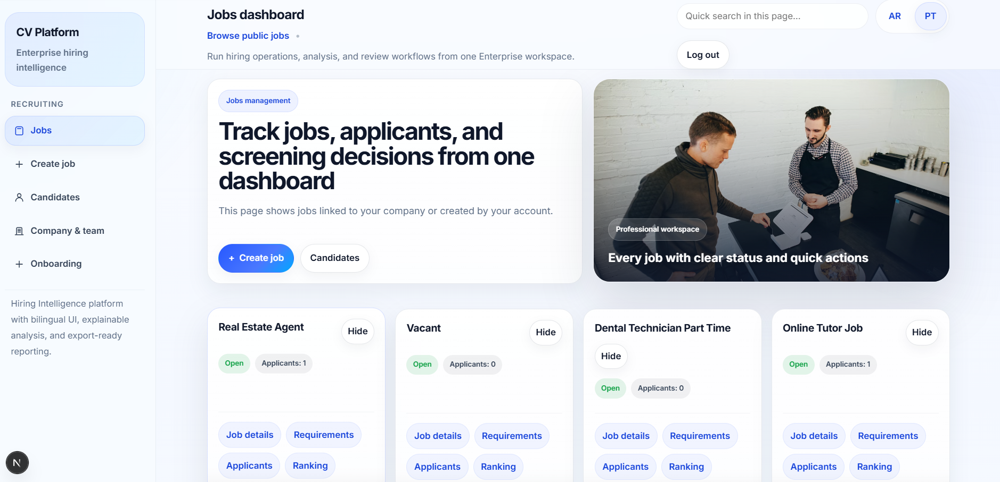
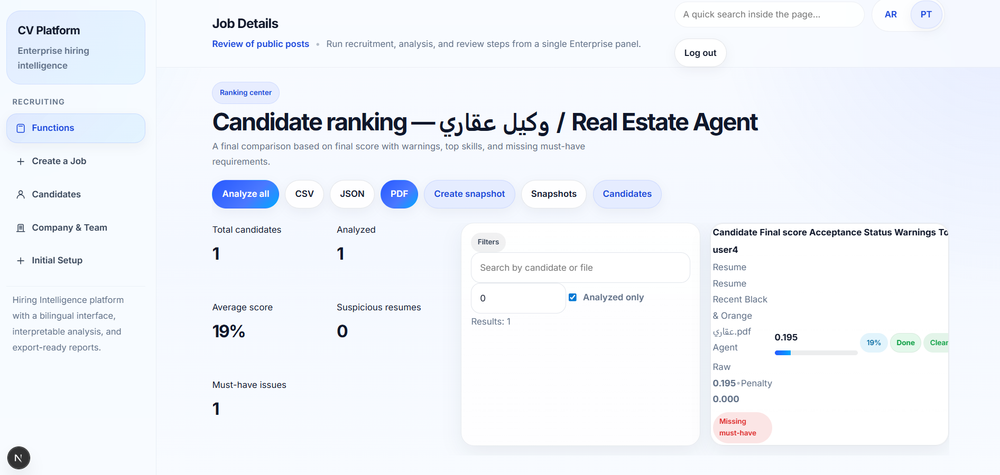
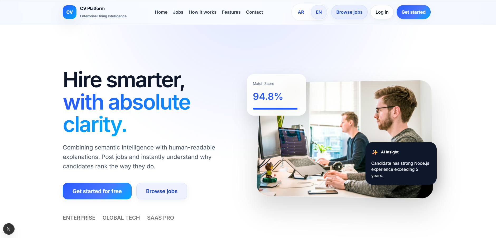
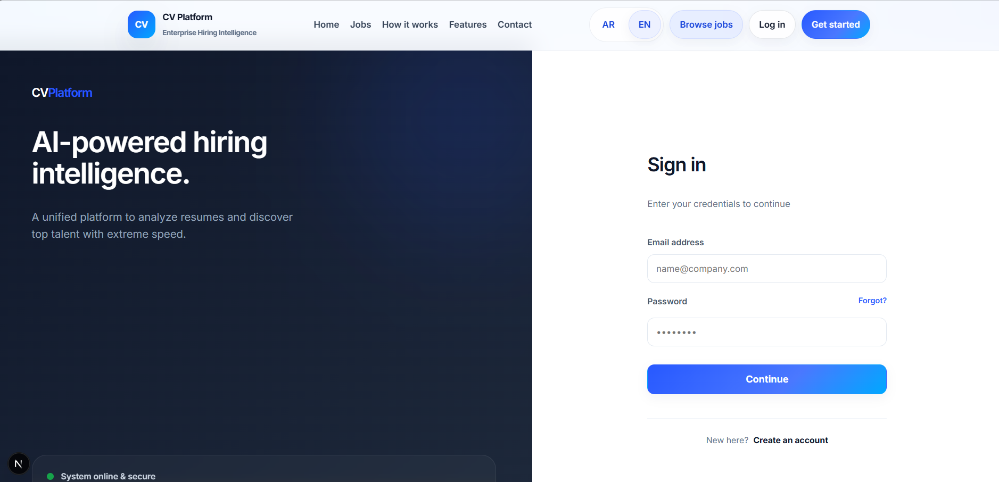
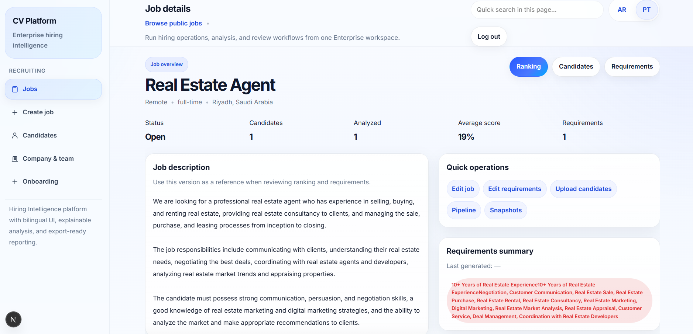
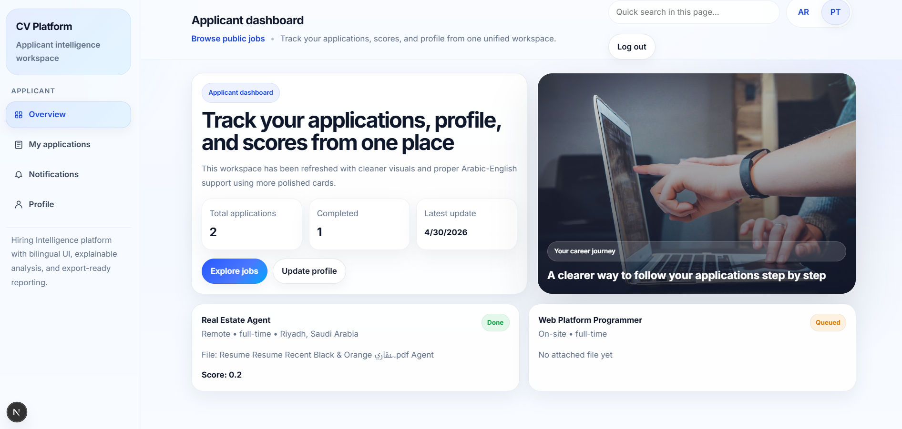
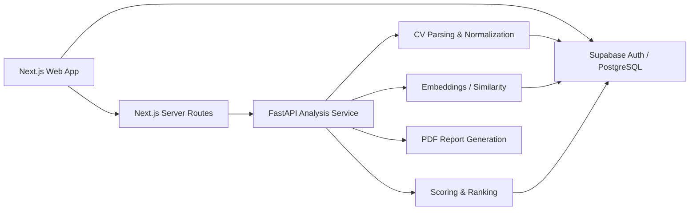

# AI CV Analysis Platform

> A bilingual full-stack recruitment platform for job publishing, applicant workflows, CV parsing, AI-assisted requirement extraction, candidate scoring/ranking, snapshots, and exportable reports.

[](https://nextjs.org)
[](https://fastapi.tiangolo.com)
[](https://supabase.com)
[](https://typescriptlang.org)
[](https://github.com/Abdulrahman-Alsebaeai)

## Overview

AI CV Analysis Platform is a production-oriented portfolio project that connects applicants and recruitment teams in one workflow. The frontend is built with Next.js/React/TypeScript, the analysis service uses FastAPI/Python, and Supabase provides PostgreSQL, authentication, storage-oriented workflows, and Row Level Security policies.

The analysis layer supports CV text extraction, skill/domain normalization, structured parsing, job requirement generation, candidate scoring, ranking, and report generation. A lightweight offline embedding implementation is available by default, while optional Hugging Face and LLM-based parsing paths can be enabled through environment configuration.

## Core Capabilities

### Applicant Experience
- Public job browsing and job details.
- Account registration and authentication.
- Applicant dashboard and profile.
- Application tracking and notifications.
- Resume/CV submission workflows.

### Recruiter / Evaluator Experience
- Job creation, editing, status control, and requirement management.
- Candidate records and resume details.
- Candidate ranking and scoring views.
- Hiring pipeline workflows.
- Analysis snapshots for reproducible review states.
- JSON, CSV, and PDF export routes.

### AI / NLP Layer
- PDF/DOCX text extraction.
- Arabic/English skill and domain normalization.
- Requirement suggestion/generation.
- Candidate-to-job scoring and ranking.
- Local lightweight embeddings with optional multilingual E5 support.
- Optional Gemini/OpenAI structured CV parsing when API keys are configured.

## Screenshots

### Recruitment Dashboard


### Candidate Ranking


<details>
<summary>More screenshots</summary>






</details>

## Architecture



## Technology Stack

| Layer | Technology |
|---|---|
| Web | Next.js 16, React 19, TypeScript |
| Styling | Tailwind CSS + application CSS |
| Backend API | FastAPI, Python |
| Database/Auth | Supabase / PostgreSQL |
| Security | Row Level Security policies, server-side role checks, API key for analysis service |
| Document parsing | `pdfplumber`, `python-docx` |
| AI/NLP | Local hashing embedder; optional Sentence Transformers / Transformers / Torch |
| Optional LLM parsing | Gemini or OpenAI via environment keys |
| Reporting | ReportLab |

## Repository Structure

```text
frontend/
├── src/app/           # Next.js routes and server endpoints
├── src/interfaces/    # Applicant, recruiter/evaluator, public UI
├── src/components/    # Reusable UI components
└── src/lib/           # Supabase, auth, environment helpers
api/
├── app/ai/            # Parsing, embeddings, lexicons, ranking logic
├── app/routers/       # Analysis and reporting routes
├── app/services/      # Supabase/data services
└── app/core/          # Auth, health, exception handlers
supabase/migrations/   # Schema, RLS, storage/vector support
docs/screenshots/      # Portfolio screenshots
```

## Database Scope

The included migrations define recruitment entities such as companies, profiles, jobs, job requirements, applicants/candidates, resumes, candidate scores, embedding tables, analysis snapshots, and notifications. RLS policies are included to separate applicant access from company/recruiter workflows.

## Local Development

### 1. Configure Supabase

Create a Supabase project, then apply the SQL migrations in `supabase/migrations/` in numerical order. Review each migration before applying it to an existing database.

### 2. Backend

```bash
cd api
python -m venv .venv
# Windows: .venv\Scripts\activate
# Linux/macOS: source .venv/bin/activate
pip install -r requirements.txt
cp .env.example .env
uvicorn app.main:app --reload --port 8000
```

For the optional heavier AI dependencies:

```bash
pip install -r requirements-ai-full.txt
```

### 3. Frontend

```bash
cd frontend
npm ci
cp .env.example .env.local
npm run dev
```

Open `http://localhost:3000`. The API documentation is available at `http://localhost:8000/docs`.

## Environment & Secret Safety

Real `.env` and `.env.local` files are intentionally excluded from this repository. Never expose `SUPABASE_SERVICE_ROLE_KEY`, database credentials, private API keys, or production analysis keys in client-side variables.

The supplied `.env.example` files contain placeholders only.

## Offline vs Optional AI Modes

The backend defaults to `EMBEDDING_MODE=cheap_local`, which uses a lightweight local hashing embedder and does not require model downloads. You can opt into a local Sentence Transformers model by placing it under `api/app/ai/models/e5/` and changing the environment configuration. Gemini/OpenAI structured parsing is also optional and disabled unless keys are supplied.

## Validation

The Python backend source in the supplied project passes `python -m compileall`. Frontend type checking is available through:

```bash
cd frontend
npm run typecheck
```

## Author

**Abdulrahman Al-Sebaeai** — Computer Science / Full-Stack & AI Projects  
GitHub: [@Abdulrahman-Alsebaeai](https://github.com/Abdulrahman-Alsebaeai)

## License

Copyright © 2026 Abdulrahman Al-Sebaeai. All rights reserved. See [`LICENSE`](LICENSE).
